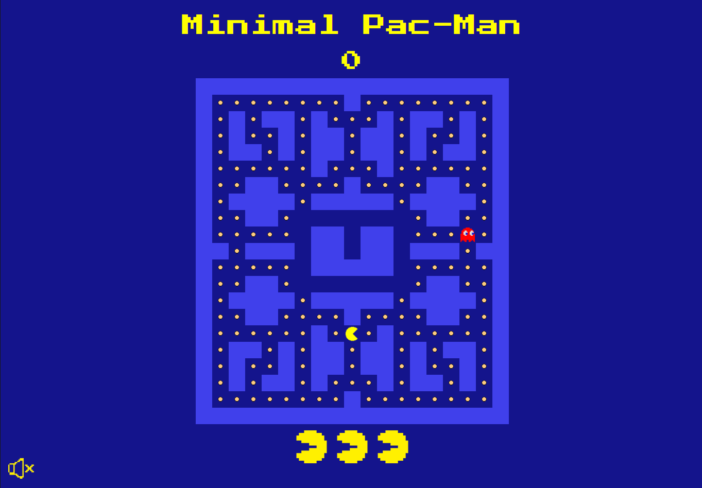

# Minimal Pac-Man

## Description 
A simple web-based version of Pac-Man, the maze was designed by me [Prototype Design](./Design-Prototype.md). The game also features endings with overlay [Game Endings](./Game-Endings.md) along with a mute button.

**How To Play:**
- Use Arrow or WASD  Keys in order to move Up, Right, Down, Left.
- Try to collect all the pellets in the maze without losing all 3 lives in order to win
- Colliding with Ghost will cost you a live (BE CAREFUL).

## Technologies
1. **HTML** for the skeleton and structure of the game.
2. **CSS** for styling the game and make it visually engaging.
3. **JavaScript** for implementing the functionality of the game and making it alive.
4. **GitHub** for version controlling and deploying the game

## User Stories
1. As a User, I want to see a map/board.
2. As a User, I want Pac-Man to be able to move in 4 directions.
3. As a User, I want visible walls to limit Pac-Man's movements and make it more challenging.
4. As a User, I want to see food pellets that Pac-Man should eat/collect to win.
5. As a User, I want to see the game stats like the score,lives.
6. As a User, I want to see ghosts in the map that when collided with pac-man, he dies. 
7. As a User, I want to see the score in the game stats increase as pac-man eats more food pellets.
8. As a User, I want Pac-Man to win by eating all the food particles in the map.
9. As a User, I want Pac-Man to lose when all his lives are consumed.
10. As a User, I want Pac-Man to Respawn after dying once.
11. As a User, I want to be able to pause the Game  

