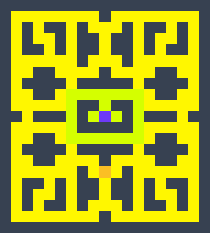

# Pac-Man Web Based Game

## Description 
A simple web-based version of Pac-Man 

## Maze Prototype Design 

This maze prototype of the was designed by using [this](https://www.toolszone.net/en/tools/tilemap-editor) website.

### Size
 - **Width:** 19 Cells
 - **Height:** 21 Cells
 - **Cell Size:** 16x16 Pixels 
### Colors Representation
- **Black/Dark Gray** Represents the Walls of the Maze.
- **Yellow** & **Lime** Represents the cells that Pac-Man can move in. 
- Only **Yellow** Represents the cells that pellets(dots) should be placed for pac-man to eat.
- Only **Lime** Represents the cells without pellets inside.
- **Purple** Represents the Spawn Cell of the Ghost Entity. 
- **Orange** Represents teh Spawn Cell of Pac-Man.

## Technologies
1. **HTML** for the skeleton and structure of the game.
2. **CSS** for styling the game and make it visually engaging.
3. **JavaScript** for implementing the functionality of the game and making it alive.

## User Stories
1. As a User, I want to see a map/board.
2. As a User, I want Pac-Man to be able to move in 4 directions.
3. As a User, I want visbile walls to limit Pac-Man's movements and make it more challenging.
4. As a User, I want to see food particals that Pac-Man should eat/collect to win.
5. As a User, I want to see the game stats like the score,lives 
6. As a User, I want to see ghosts in the map that when collided with pac-man, he dies. 
7. As a User, I want to see the score in the game stats increase as pac-man eats more food particles
8. As a User, I want Pac-Man to win by eating all the food particles in the map
9. As a User, I want Pac-Man to lose when all his lives are consumed.
10. As a User, I want Pac-Man to Respawn after dying once.
11. As a User, I want to be able to pause the Game  

